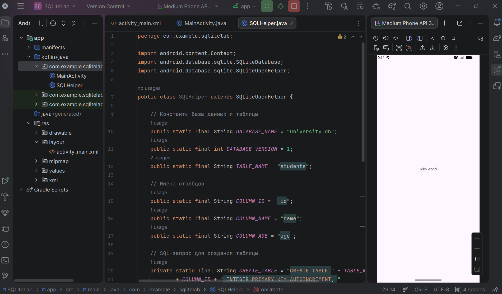
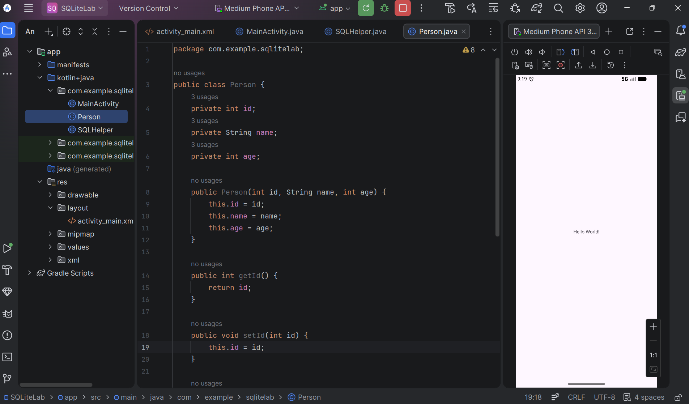
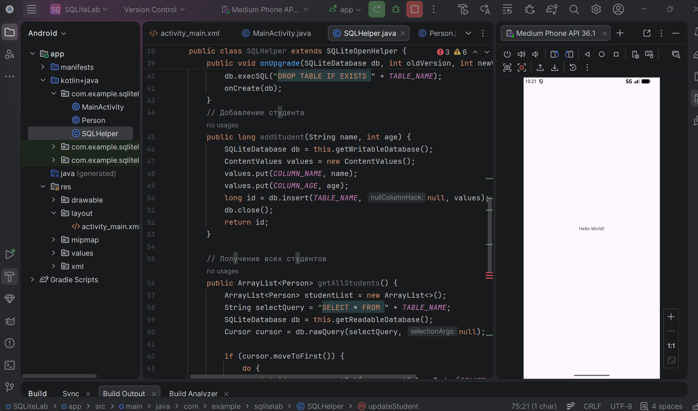
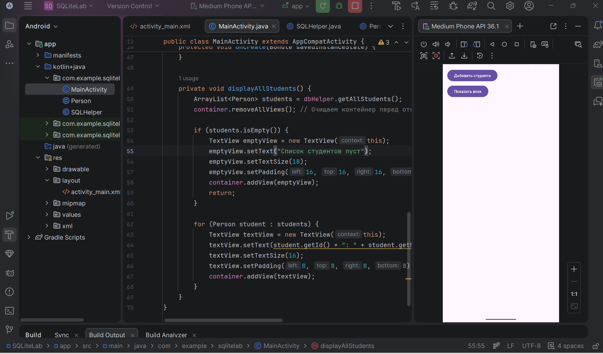
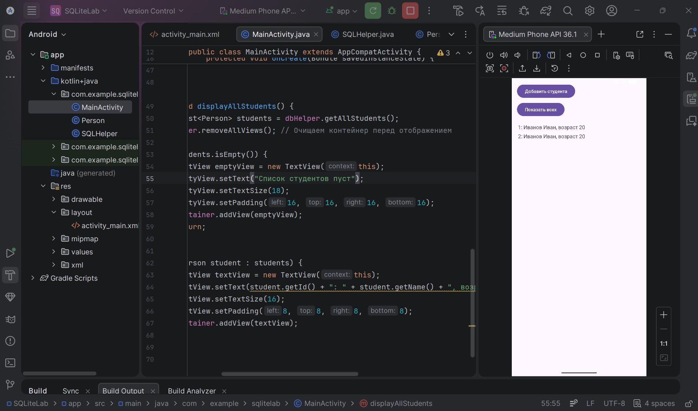
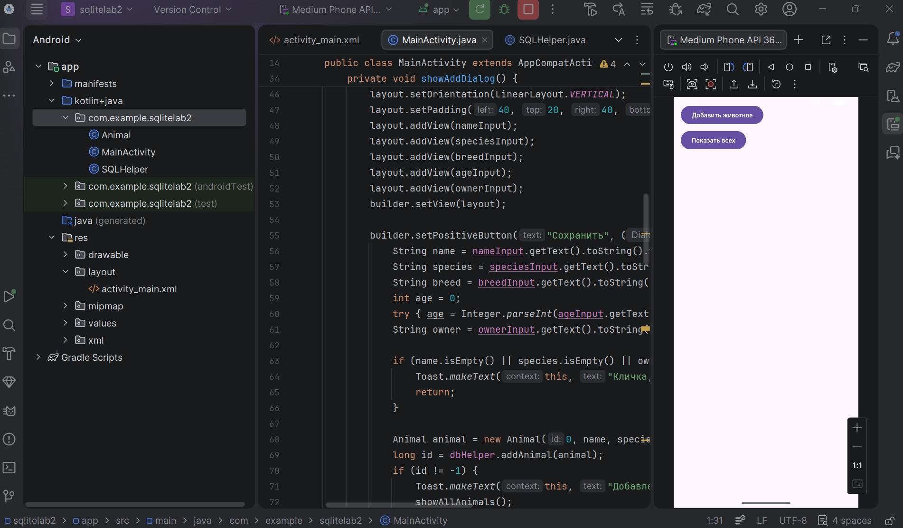
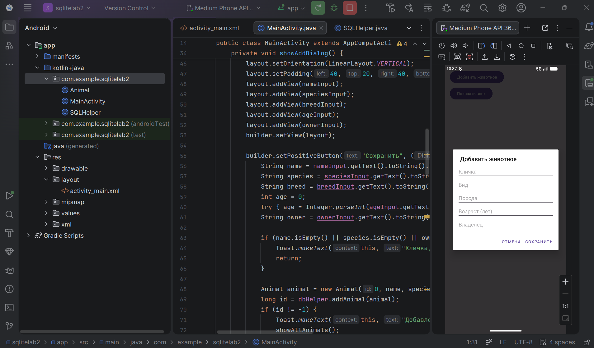
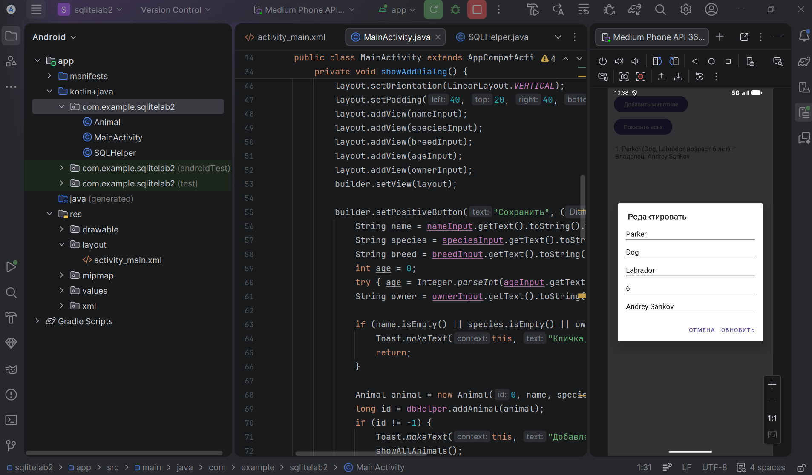
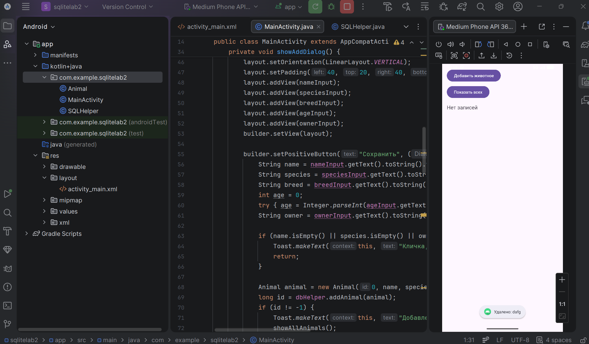

# Практическая работа №4: Работа с встроенной базой данных SQLite

**Выполнил:**  
Саньков Андрей Александрович  
Группа: ИНС-б-о-24-1  
Направление: 09.03.02 «Информационные системы и технологии»

---

## Цель работы

Изучить основы работы с СУБД SQLite в Android-приложениях. Научиться создавать базу данных, таблицы, выполнять основные операции CRUD (Create, Read, Update, Delete) с использованием класса SQLiteOpenHelper и отображать данные на экране.

---

## Ход работы

### Задание 1. Создание класса-помощника SQLHelper

Создан новый проект с именем SQLiteLab. В пакете проекта создан класс SQLHelper, наследующий SQLiteOpenHelper. Определены константы для названия базы данных, версии, таблицы и столбцов. Реализованы методы onCreate() (создание таблицы студентов) и onUpgrade() (обновление БД).



**Рисунок 1** — Класс SQLHelper

---

### Задание 2. Создание модели данных Person

Создан класс Person с полями id, name, age. Добавлены конструктор, геттеры и сеттеры.



**Рисунок 2** — Модель данных Person

---

### Задание 3. Реализация методов CRUD в SQLHelper

В класс SQLHelper добавлены методы:
- addStudent() — добавление записи.
- getAllStudents() — получение всех записей в виде `ArrayList<Person>`.
- updateStudent() — обновление записи.
- deleteStudent() — удаление записи по id.



**Рисунок 3** — Реализация CRUD-методов

---

### Задание 4. Работа с БД в MainActivity

Создан интерфейс с двумя кнопками («Добавить студента» и «Показать всех») и LinearLayout для вывода списка. В MainActivity получен экземпляр SQLHelper, настроены обработчики кнопок. При нажатии на «Добавить» в БД добавляется тестовая запись, при нажатии на «Показать» — список студентов выводится на экран.



**Рисунок 4** — Интерфейс приложения



**Рисунок 5** — Отображение добавленных записей

---

## Задания для самостоятельного выполнения

Выбран вариант 10: **Ветеринарная клиника**. Реализовано приложение для работы с таблицей animals. Структура таблицы:

| Поле | Тип | Описание |
|------|-----|----------|
| _id | INTEGER PRIMARY KEY AUTOINCREMENT | Идентификатор |
| name | TEXT NOT NULL | Кличка животного |
| species | TEXT NOT NULL | Вид (кошка, собака и т.д.) |
| breed | TEXT | Порода |
| age | INTEGER | Возраст (в годах) |
| owner | TEXT | Владелец |

Функциональность приложения:
- **Добавление** записи через диалоговое окно (все поля).
- **Просмотр** списка всех животных.
- **Редактирование** записи по нажатию на элемент списка (открывается диалог с предзаполненными данными).
- **Удаление** записи по долгому нажатию с подтверждением.

### Интерфейс и работа



**Рисунок 6** — Главный экран: список добавленных животных



**Рисунок 7** — Диалог добавления нового животного



**Рисунок 8** — Диалог редактирования данных



**Рисунок 9** — Удаление записи по долгому нажатию


## Контрольные вопросы 

### 1. Какие типы данных поддерживает SQLite? Как в SQLite можно хранить логические значения и даты?

SQLite поддерживает пять основных типов (аффинитетов):
- NULL – пустое значение.
- INTEGER – целое число (1, 2, 3, 4, 6 или 8 байт).
- REAL – число с плавающей точкой (8 байт).
- TEXT – текстовая строка (UTF-8 или UTF-16).
- BLOB – бинарные данные.

**Логические значения** обычно хранятся как `INTEGER`, где `1` соответствует `true`, а `0` – `false`.  
**Даты** можно хранить в трёх форматах:
- TEXT – в формате ISO8601 (`"YYYY-MM-DD HH:MM:SS.SSS"`).
- INTEGER – количество секунд с 1970-01-01 00:00:00 (Unix timestamp).
- REAL – юлианские дни.


### 2. Для чего нужен класс SQLiteOpenHelper? Опишите назначение методов onCreate() и onUpgrade().

SQLiteOpenHelper – вспомогательный класс для управления созданием и обновлением базы данных. Он инкапсулирует логику создания, открытия и обновления БД, а также управляет версионированием.

- **onCreate(SQLiteDatabase db)** – вызывается автоматически, когда база данных создаётся впервые. Здесь выполняются SQL-запросы для создания таблиц, индексов и первоначального заполнения данными.
- **onUpgrade(SQLiteDatabase db, int oldVersion, int newVersion)** – вызывается, когда версия базы данных увеличивается. Используется для миграции данных при изменении структуры таблиц (например, добавление/удаление столбцов, переименование таблиц).


### 3. В чем разница между методами getWritableDatabase() и getReadableDatabase()? В каких ситуациях может возникнуть ошибка при вызове getWritableDatabase()?

- **getWritableDatabase()** – возвращает объект SQLiteDatabase для чтения и записи. Если БД доступна только для чтения (например, из-за ошибки диска или прав), метод выбросит исключение.
- **getReadableDatabase()** – возвращает объект для чтения. Если запись невозможна, он всё равно вернёт объект (возможно, в режиме только чтения), если чтение возможно.

Ошибка при вызове getWritableDatabase() может возникнуть в следующих ситуациях:
- Недостаточно места на диске.
- База данных находится на защищённом носителе, доступном только для чтения.
- Системные ограничения или сбой в работе файловой системы.


### 4. Что такое Cursor? Как правильно перемещаться по его элементам и почему важно закрывать его после использования?

**Cursor** – интерфейс, предоставляющий произвольный доступ к результатам SQL-запроса. Он позволяет перемещаться по строкам, читать значения столбцов и получать метаданные (количество столбцов, имена и т.д.).

**Перемещение по элементам:**
```java
Cursor cursor = db.rawQuery("SELECT * FROM students", null);
if (cursor.moveToFirst()) {
    do {
        // читаем данные текущей строки
        int id = cursor.getInt(cursor.getColumnIndex("_id"));
        String name = cursor.getString(cursor.getColumnIndex("name"));
    } while (cursor.moveToNext());
}
cursor.close(); // обязательно закрываем
